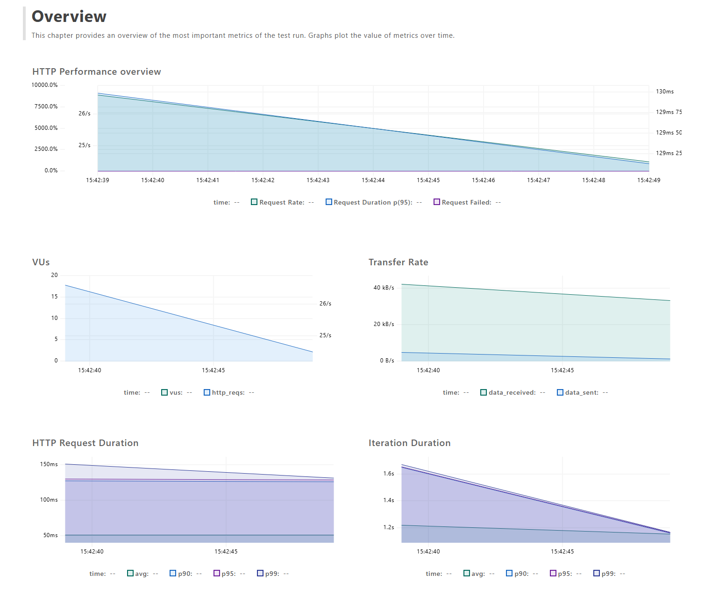
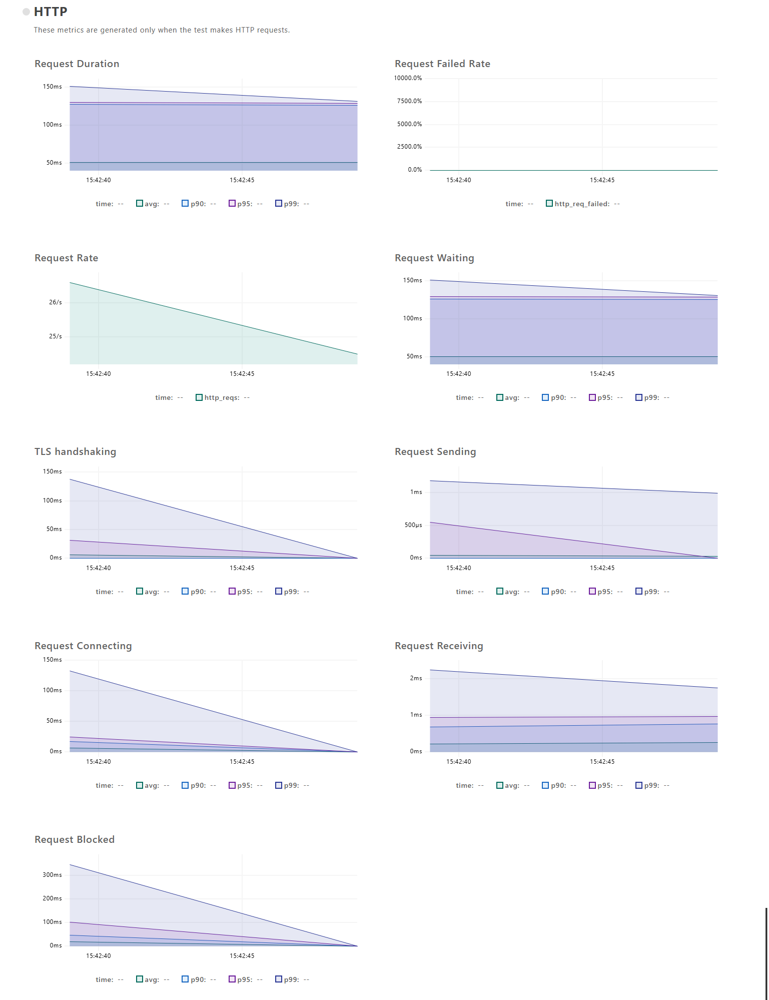

# k6 Performance Testing Playground

> **Purpose**: This repository is a **playground** designed to evaluate and demonstrate the capabilities of **k6**, **InfluxDB**, and **Grafana** for performance testing.

This project is a comprehensive performance testing suite, showing how to integrate these tools into a modern workflow.

## 🤖 AI Assisted Development

This project was created with the assistance of **Antigravity**, an agentic AI coding assistant developed by **Google Deepmind**.

---

## 📂 Project Structure

- **Scripts** (`src/tests/`):
  - `src/tests/performance_test.js`: Unified script that handles all test types based on parameters.
- **Configuration** (`config/`):
  - `config/common.json`: Shared test scenarios (stages, thresholds) for each test type (`smoke`, `load`, `stress`, `spike`).
  - `config/env/*.json`: Environment-specific settings (e.g. `baseUrl`).
- **Visualization (Docker)**:
  - `docker-compose.yml`: Stack with InfluxDB and Grafana.
  - `grafana/`: Provisioning configs and dashboards.
- **Reporting**:
  - `src/tests/lib/junit.js`: Local reporter for generating CI/CD compatible XMLs.
  - `run_all_tests.ps1`: Helper script to run the full suite.
  - `validate_tests.ps1`: CI validation script (syntax check).

## 🚀 Getting Started

### Prerequisites

1. **k6**: [Install k6](https://k6.io/docs/get-started/installation/) (e.g., `winget install k6`).
2. **Docker**: Required for dashboard and history.

### Configuration
Customize the tests by editing `config/common.json` (scenarios) or `config/env/*.json` (URLs).
- **baseUrl**: Target URL (in `config/env/dev.json`).
- **thresholds**: Pass/Fail criteria (in `config/common.json`).

### Parameter Injection
The unified script uses environment variables to control its behavior:
- **ENV**: Target environment (`dev`, `prod`). Default: `dev`.
- **TEST_TYPE**: Test scenario to run (`smoke`, `load`, `stress`, `spike`). Default: `smoke`.

### 🎯 Arrival Rate Model
This project uses the **Arrival Rate** model (specifically `constant-arrival-rate` and `ramping-arrival-rate`). 
- **Predictability**: We define exactly how many requests per second (RPS) we want to achieve.
- **Decoupling**: The load is independent of the system's response time. Even if the server slows down, k6 will attempt to maintain the target rate.
- **Efficiency**: No manual `sleep` statements are needed in the code; k6 manages the pacing automatically.

Example:
```powershell
k6 run -e ENV=prod -e TEST_TYPE=load src/tests/performance_test.js
```

## 🏃 Running Tests

> [!NOTE]
> If `k6` is not in your PATH, use the full path: `& 'C:\Program Files\k6\k6.exe' ...`

### 1. CI Validation (Build Step)
Run this to check script syntax without executing tests (useful for CI "Build" step).
```powershell
./validate_tests.ps1
```

### 2. Run All Sequentially (Recommended)
This script runs Smoke -> Load -> Spike -> Stress tests one by one using the unified script, sends metrics to InfluxDB, and generates XML reports.
```powershell
./run_all_tests.ps1
```

### 3. Run Manually
You can run individual scenarios using k6 by passing the `TEST_TYPE`:

```powershell
# Run smoke test (default)
k6 run src/tests/performance_test.js

# Run load test
k6 run -e TEST_TYPE=load src/tests/performance_test.js

# Run with output to InfluxDB (for Dashboard)
k6 run --out influxdb=http://localhost:8086/k6 -e TEST_TYPE=stress src/tests/performance_test.js
```

#### 📄 HTML Reports (Optional)

The native k6 web dashboard can export an HTML report. To generate it, set the following environment variables before running a test:

```powershell
$env:K6_WEB_DASHBOARD = "true"
$env:K6_WEB_DASHBOARD_EXPORT = "reports/html/report-load.html"
```

Then run the test as usual, e.g.:

```powershell
k6 run -e TEST_TYPE=load src/tests/performance_test.js
```

The HTML file will be saved to `reports/html/`. You can open it in a browser to view the full results.

**Note:** HTML export is only available in k6 versions >= 0.49. If your k6 version is older, this feature is unavailable.

## 📊 Dashboard (Grafana + InfluxDB)

A pre-configured Grafana dashboard is available to visualize test results.

1. **Start the stack**:
   ```powershell
   docker-compose up -d
   ```
2. **Open Grafana**:
   - URL: [http://localhost:3000](http://localhost:3000)
   - Go to **Dashboards** -> **k6 Load Testing Results**.
3. **Features**:
   - **Filtering**: Use **Test Type** (smoke, load, etc.) to view specific metrics.
   - **Comparison**: Use **Run ID** to select multiple test runs and compare them side-by-side in the "Comparison" row.

## 🤖 CI/CD Integration (TeamCity)

The project is ready for TeamCity integration.
Every test execution generates a **JUnit XML** report in the `reports/xml/` directory:
- `reports/xml/result-smoke.xml`
- `reports/xml/result-load.xml`
- etc. (filename is based on `TEST_TYPE`)

**Setup in TeamCity**:
1. Add the **XML Report Processing** build feature.
2. Select **Ant/JUnit** report type.
3. Monitor pattern: `reports/xml/result-*.xml`.

TeamCity will display pass/fail statistics based on the **thresholds** defined in `config/common.json`.

## 📈 Expected Output

When running the test suite, you should see a summary similar to this:

```text
     scenarios: (100.00%) 1 scenario, 10 max VUs, 1m0s max duration (incl. graceful stop):
              * default: 200 iterations shared among 10 VUs (maxDuration: 30s, gracefulStop: 30s)


running (0m00.1s), 10/10 VUs, 0 complete and 0 interrupted iterations
   k6 results summary                                                                     
                                                                                    
running (0m23.8s), 00/10 VUs, 200 complete and 0 interrupted iterations             
default ✓ [===============================] 10 VUs  23.8s/30s  200/200 shared iters 
```

## 📊 Report Analysis

If you enable the HTML dashboard, the report provides deep insights into your test run.

### 1. Summary Header
Located at the very top, this bar provides a quick check on the health of your test run.
- **checks**: The most important metric (e.g., `100/100.0%` means all assertions passed).
- **http_req_duration**: Quick peek at latency stats (avg, p95).
- **Date**: Timestamp of the run.



### 2. Performance Graphs
The core visualization area. The visible charts allow you to spot trends immediately:

- **Request Rate (Green)**: The number of requests per second (RPS). A decline here might indicate the system is struggling.
- **Request Duration (Purple)**: The overall latency distribution (p90, p95). Spikes here show performance degradation.
- **Request Waiting (Blue)**: Time waiting for the first byte (TTFB).
- **TLS Handshaking**: Time spent on SSL negotiation.

*(Other metrics like Connecting and Sending are available by scrolling down)*



### 3. Statistics Table
The bottom section contains raw data for deep analysis.
- **Metric**: The name of the measurement (e.g., `http_req_duration`, `iteration_duration`).
- **Aggregates**: Detailed columns for `Avg`, `Min`, `Med`, `Max`, `p90`, and `p95`.
- Use this table to debug specific outliers seen in the graphs.


